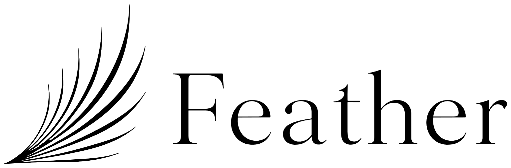
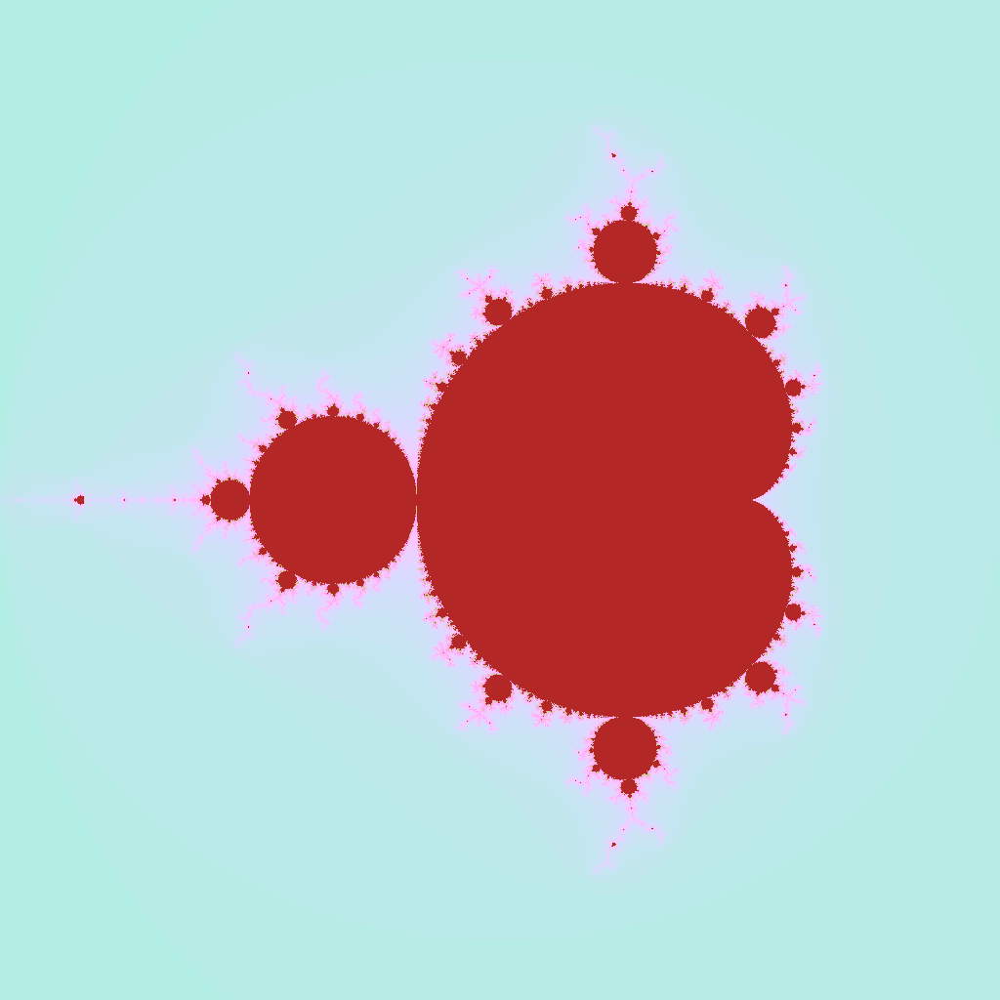
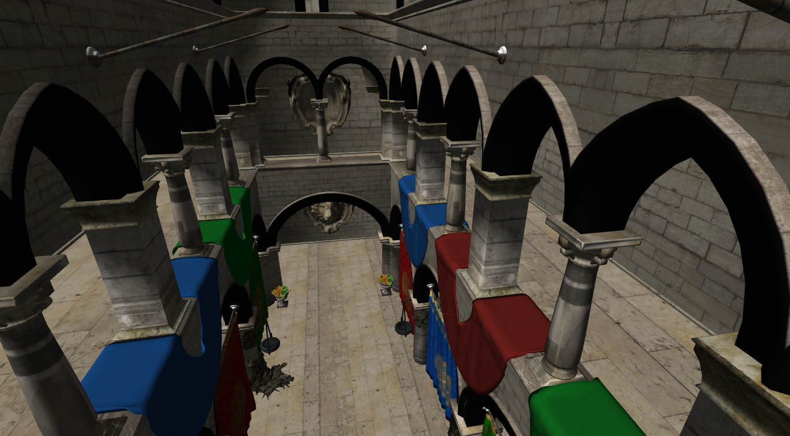
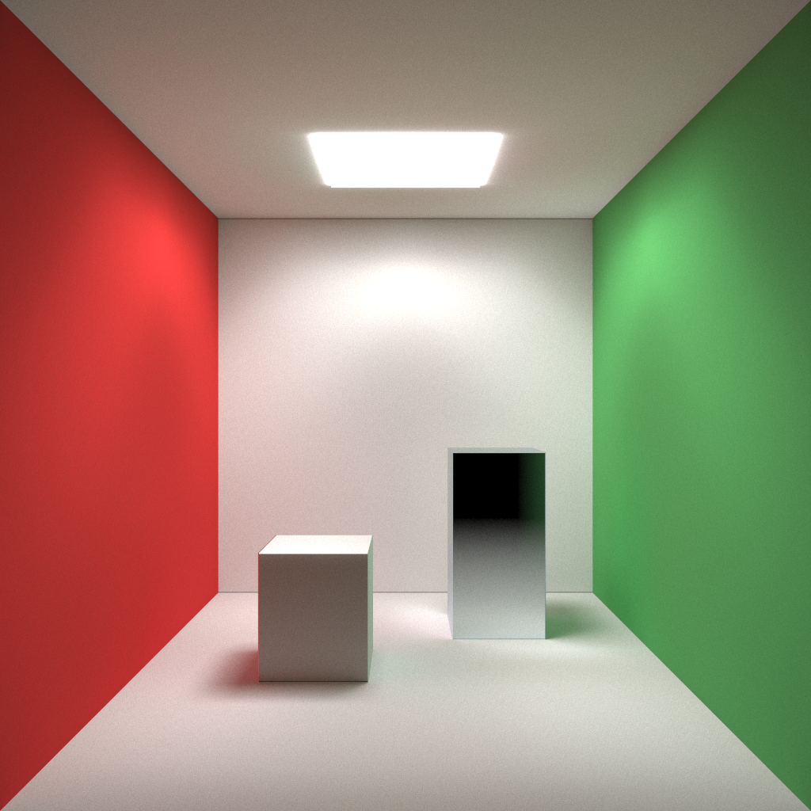
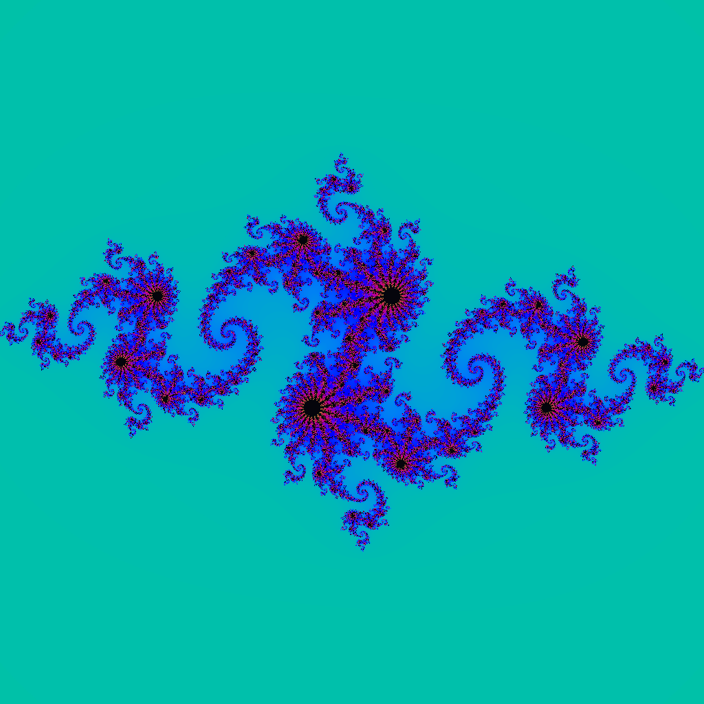
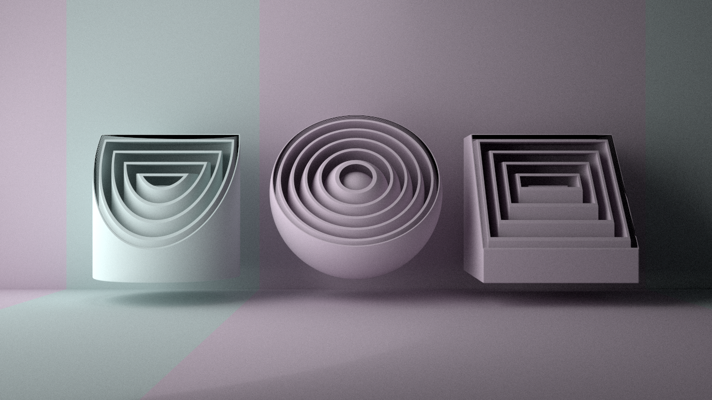
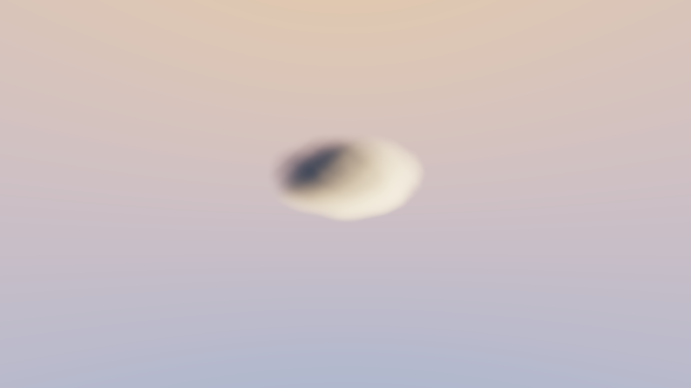

<div align="center">



# Feather.NET

Write GPU compute kernels, texture pipelines, raster shaders, reverse-mode automatic differentiation, and small neural-network experiments in C#.

[Documentation](docs/README.md) | [Getting Started](docs/getting-started.md) | [Examples](docs/examples.md) | [API Reference](docs/api.md) | [FEIR](docs/feir.md) | [Support Status](docs/support-status.md)

[](https://www.nuget.org/packages/FeatherCompute)
[](https://www.nuget.org/packages/FeatherCompute)
[](https://github.com/FeatherCompute/Feather/actions/workflows/ci.yml)

</div>

---

Feather is a .NET front end for [EasyGPU](EasyGPU/). You write GPU code as normal C# `readonly partial struct` types, the Roslyn generator lowers the supported shader subset into Feather IR (FEIR), and the native bridge sends typed IR into EasyGPU for GLSL/SPIR-V execution.

Feather is currently experimental. The compute path is the most mature surface. Windowing, graphics, automatic differentiation, and `Feather.NN` are usable preview APIs that are proven by samples and tests but should still be treated as evolving.

## What You Can Build

| Compute and fractals | Raster and ray-style graphics | AD and NN experiments |
| --- | --- | --- |
|  |  |  |
|  |  |  |

Feather is designed for C# developers who want to stay inside .NET while writing GPU workloads:

- Compute kernels over buffers, 2D textures, and 3D textures.
- Shader math with `float2`, `float3`, `float4`, matrices, swizzles, and HLSL-style helpers.
- Reusable `[ShaderLibrary]` callables for shared BRDF, SDF, sampling, and math code.
- Native windows and texture presentation for interactive GPU output.
- Preview raster pipelines written as C# vertex and fragment shaders.
- Preview reverse-mode AD for generated 1D kernels through EasyGPU's gradient tape.
- Preview NN helpers for tensors, modules, optimizers, checkpoints, and AD-backed training loops.
- IR/GLSL inspection for debugging generated kernels and understanding the compiler pipeline.

## Quick Start

Prerequisites:

- .NET SDK `10.0.301` or a compatible SDK feature band.
- CMake 3.20+ and a C++20 compiler for the native bridge.
- A GPU/driver supported by the selected EasyGPU backend.
- Vulkan SDK when building the Vulkan backend.
- X11 development libraries on Linux when using windows.

Install the preview package from NuGet:

```bash
dotnet add package FeatherCompute --prerelease
```

Or pin the current preview release explicitly:

```bash
dotnet add package FeatherCompute --version 0.1.0-preview.13
```

The NuGet package ID is `FeatherCompute`; the public C# namespaces remain
`Feather`, `Feather.Math`, `Feather.Resources`, and related subnamespaces. Most
projects only need this one package. It brings in the source generator, native
loader, and published native assets through companion packages.

Current preview packages include native assets for:

- `linux-x64`
- `osx-arm64`
- `win-x64`

Other runtime identifiers can still use Feather from source or with
`FEATHER_NATIVE_LIBRARY=/absolute/path/to/<native-library>` pointing at a
custom native build.

Build from the repository root:

```bash
git submodule update --init --recursive

cmake -S native -B native/build -DEASYGPU_BACKEND=Vulkan
cmake --build native/build --target feather --parallel

dotnet build Feather.slnx
dotnet run --project samples/HelloBuffer/HelloBuffer.csproj
```

The native loader also honors `FEATHER_NATIVE_LIBRARY=/absolute/path/to/<native-library>`, which is useful when testing a custom native build.

## First Kernel

```csharp
using Feather;
using Feather.Math;
using Feather.Resources;

float[] input = [1, 2, 3, 4];

using var src = GPU.CreateBuffer<float>(input, BufferAccess.ReadOnly);
using var dst = GPU.CreateBuffer<float>(input.Length, BufferAccess.ReadWrite);

GPU.Dispatch(new DoubleKernel(src.AsReadOnly(), dst.AsReadWrite()), input.Length);

Console.WriteLine(string.Join(", ", dst.ToArray()));

[Kernel]
[ThreadGroupSize(DefaultThreadGroupSizes.X)]
public readonly partial struct DoubleKernel(
    ReadOnlyBuffer<float> input,
    ReadWriteBuffer<float> output) : IKernel1D
{
    public void Execute()
    {
        int i = ThreadIds.X;
        output[i] = input[i] * 2.0f;
    }
}
```

At the call site this is ordinary C#. Inside `Execute`, Feather accepts a GPU-safe C# subset and reports `FE0001`-style diagnostics when a construct cannot be lowered. The generated kernel carries FEIR metadata, resource bindings, thread-group size, and typed shader statements into the native EasyGPU bridge.

## Core Concepts

| Concept | What to read |
| --- | --- |
| First successful build and dispatch | [Getting Started](docs/getting-started.md) |
| Thread IDs, buffers, uniforms, textures | [Tutorial](docs/tutorial.md) |
| Supported shader-language subset | [C# Shader Subset](docs/csharp-subset.md) |
| Shared shader helper libraries | [Shader Libraries](docs/shader-libraries.md) |
| Window loops and texture presentation | [Windowing](docs/window.md) |
| Vertex/fragment raster pipelines | [Graphics Pipeline](docs/graphics-pipeline.md) |
| Reverse-mode AD and gradients | [Automatic Differentiation](docs/autodiff.md) |
| Tensors, modules, optimizers | [Neural Networks](docs/nn.md) |
| FEIR and the compiler pipeline | [FEIR](docs/feir.md) |
| Public API by namespace | [API Reference](docs/api.md) |

## Automatic Differentiation

AD is a first-class preview feature, not a hidden internal path. A generated 1D kernel can mark differentiable parameters and a scalar loss:

```csharp
[Kernel]
[AutoDiff]
public readonly partial struct LossKernel(
    ReadOnlyBuffer<float> x,
    ReadWriteBuffer<float> w,
    ReadWriteBuffer<float> loss) : IKernel1D
{
    public void Execute()
    {
        int i = ThreadIds.X;
        float y = w[0] * x[i];
        float l = y * y;

        loss[i] = l;
        Feather.AD.AD.Parameter(w[0]);
        Feather.AD.AD.Loss(l);
    }
}
```

On the host, `GPU.CreateADKernel(...)` creates a wrapper that dispatches the forward path, asks EasyGPU to generate the adjoint body, and exposes named gradients for readback or device-side optimizer handoff. Start with [Automatic Differentiation](docs/autodiff.md), then read [AD Internals](docs/ad-implementation-note.md) when debugging the native bridge.

## Examples

Run samples from the repository root:

```bash
dotnet run --project samples/HelloBuffer/HelloBuffer.csproj
dotnet run --project samples/Mandelbrot/Mandelbrot.csproj -- 1024 1024 256
dotnet run --project samples/WindowCompute/WindowCompute.csproj
dotnet run --project samples/WindowGraphicsTriangle/WindowGraphicsTriangle.csproj
dotnet run --project samples/AdLinearRegression/AdLinearRegression.csproj
dotnet run --project samples/SponzaRenderer/SponzaRenderer.csproj -- Sponza
```

`SponzaRenderer` expects an external Sponza asset directory. Keep the scene in a
local `Sponza/` folder or pass the directory explicitly; the assets are not part
of the Feather source repository.

| Sample group | Samples |
| --- | --- |
| First compute | `HelloWorld`, `HelloBuffer`, `ParallelReduction`, `Histogram` |
| Image compute | `Mandelbrot`, `JuliaSet`, `RayTracing`, `SdfRenderer`, `VolumetricFog` |
| Textures | `TextureCopy`, `ColorFilter` |
| Windows | `WindowHello`, `WindowCompute`, `WindowPixels` |
| Graphics | `WindowGraphicsTriangle`, `WindowGraphicsTexturedQuad`, `SponzaRenderer` |
| AD and NN | `AdLinearRegression`, `AutoDiffLinearRegression`, `AdTransformer`, `AdGptDemo`, `AdGptPoetDemo` |
| Inspection | `SpirvOptInspection`, `ProfilerSuite` |

The full gallery with learning order, commands, and screenshots is in [Examples](docs/examples.md).

## Project Shape

When consuming Feather from NuGet, install the main package only:

```bash
dotnet add package FeatherCompute --prerelease
```

The companion packages are published so NuGet can model the runtime layout, but
most applications should not reference them directly:

| Package | Role |
| --- | --- |
| [`FeatherCompute`](https://www.nuget.org/packages/FeatherCompute) | Main package for application developers. Includes the managed API and generator analyzer. |
| [`FeatherCompute.Native`](https://www.nuget.org/packages/FeatherCompute.Native) | Native loader and P/Invoke layer used by the main package. |
| [`FeatherCompute.NativeAssets`](https://www.nuget.org/packages/FeatherCompute.NativeAssets) | RID-specific native binaries staged under NuGet's `runtimes/<rid>/native` layout. |
| [`FeatherCompute.Generators`](https://www.nuget.org/packages/FeatherCompute.Generators) | Roslyn source generator package for advanced analyzer-only scenarios. |

When consuming Feather from this repository, reference both the runtime project and the generator project:

```xml
<ItemGroup>
  <ProjectReference Include="path/to/Feather/src/Feather/Feather.csproj" />
  <ProjectReference Include="path/to/Feather/src/Feather.Generators/Feather.Generators.csproj"
                    OutputItemType="Analyzer"
                    ReferenceOutputAssembly="false" />
</ItemGroup>
```

Projects that only use windowing helpers and do not define generated kernels do not need the analyzer reference.

## Documentation

- [Documentation Index](docs/README.md): learning path and topic map.
- [API Reference](docs/api.md): public API grouped by subsystem.
- [FEIR](docs/feir.md): how C# becomes native EasyGPU work.
- [Support Status](docs/support-status.md): maturity, platform notes, and current limits.
- [Diagnostics](docs/diagnostics.md): common generator and runtime errors.
- [Packaging](docs/packaging.md): source consumption, native assets, and local packages.

## License

Feather is licensed under the [MIT License](LICENSE). EasyGPU is consumed as a
submodule and keeps its own [license](EasyGPU/LICENSE).
