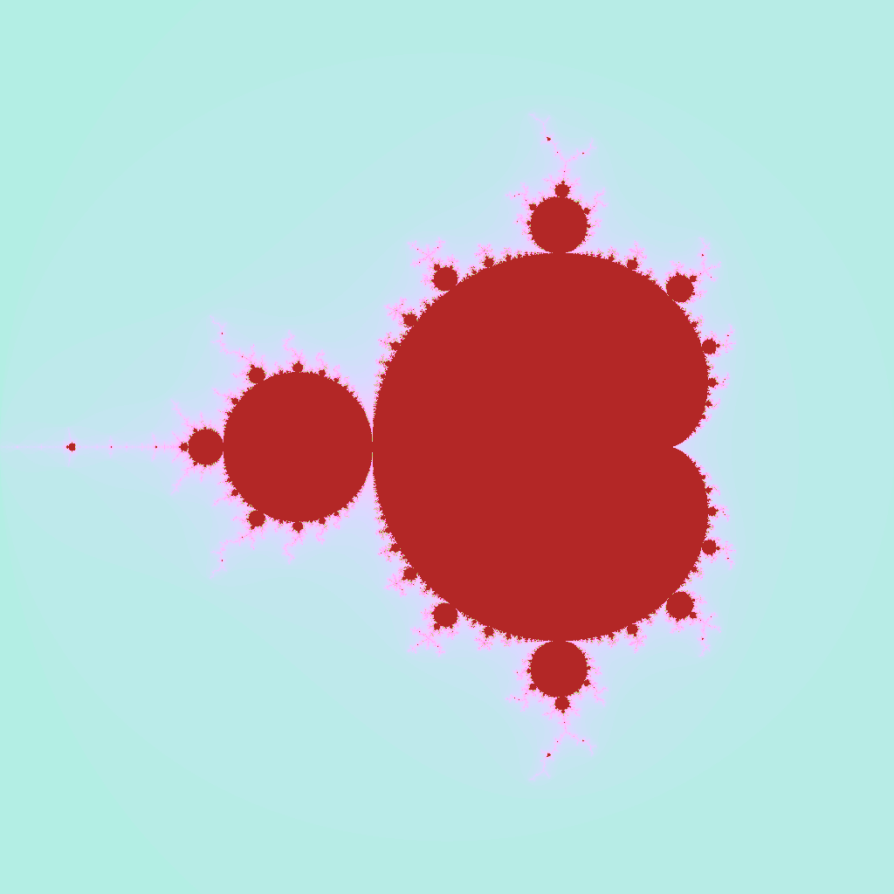
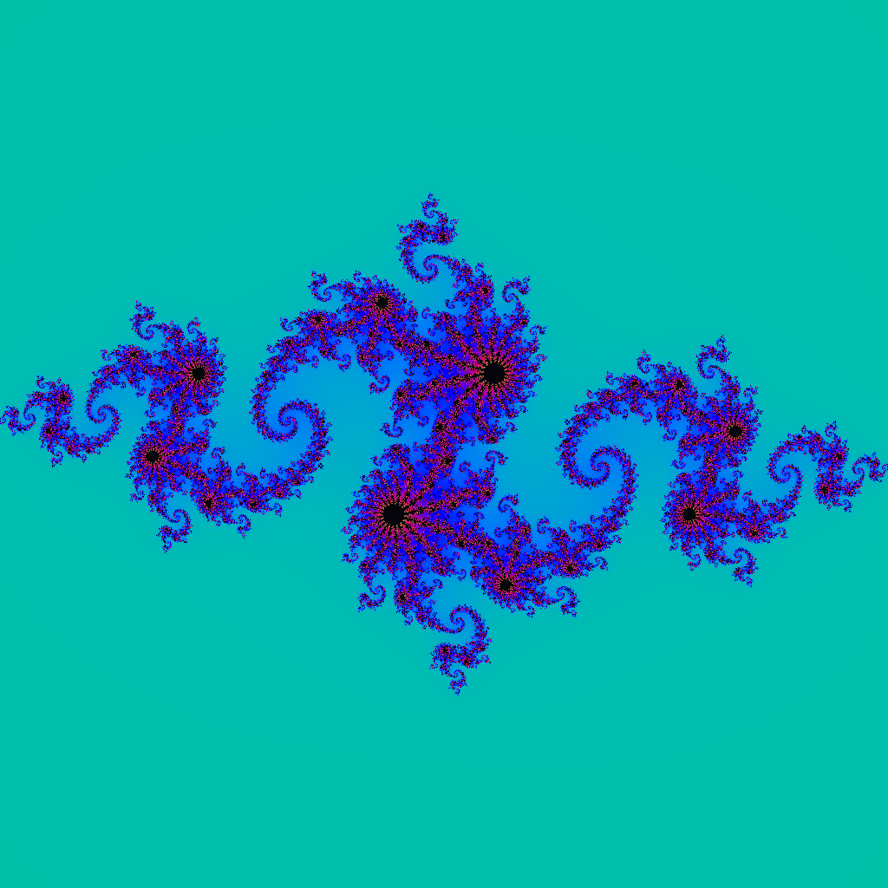
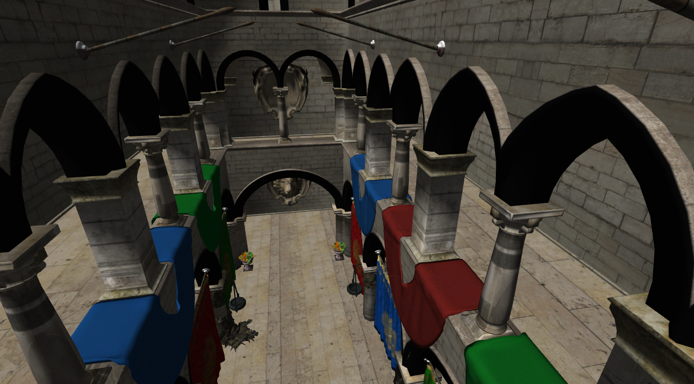
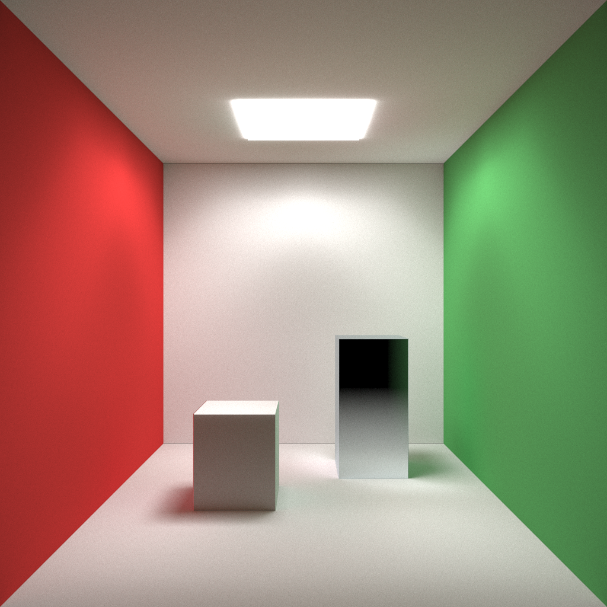
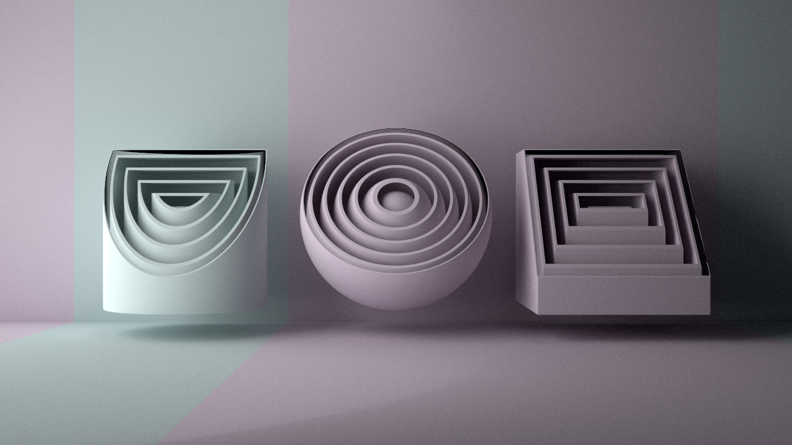
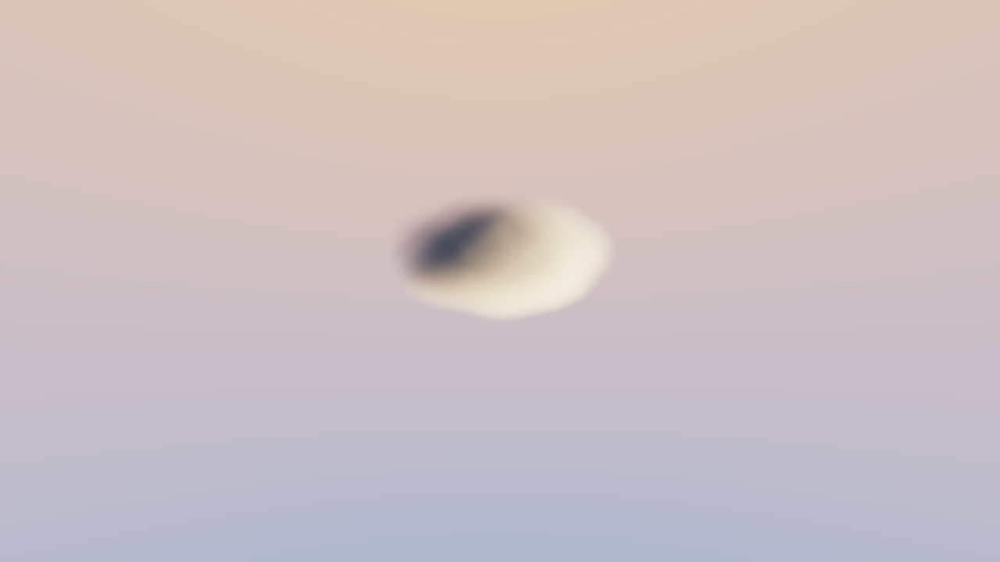

# Examples

Feather ships samples that are meant to be read as a learning path. Each sample is a normal .NET project under `samples/` and can be run from the repository root.

## M6 Backend Matrix

Compute and AD samples that are supported by the LuisaCompute XIR/Vulkan path
select `GpuExecutionBackend.Luisa` explicitly and print `DispatchPath.Luisa`.
EasyGPU remains the library default and is still used by raster presentation.

| Sample | Classification | Backend decision / reason |
| --- | --- | --- |
| `AdLinearRegression` | ✅ Luisa | Direct generated AD kernel plus optimizer handoff uses Luisa. |
| `AutoDiffLinearRegression` | ✅ Luisa | Direct generated AD kernel uses Luisa; conceptual sample remains non-PASS. |
| `ColorFilter` | ✅ Luisa | Buffer compute and texture-free FEIR. |
| `GpuStructInterfaces` | ✅ Luisa | Struct, callable, and interface-monomorphized compute. |
| `HelloBuffer` | ✅ Luisa | Minimal buffer compute. |
| `HelloWorld` | ✅ Luisa | Uniform and buffer compute. |
| `Histogram` | ✅ Luisa | Buffer copy baseline. |
| `JuliaSet` | ✅ Luisa | 2D math/callable compute. |
| `Mandelbrot` | ✅ Luisa | 2D math/callable compute. |
| `ParallelReduction` | ✅ Luisa | Barrier and buffer compute. |
| `ProfilerSuite` | ✅ partial | Compute and AD cases use Luisa; NN trainer and raster cases remain EasyGPU. |
| `RayTracing` | ✅ Luisa | The sample is a pure compute path tracer; it does not use hardware RT/acceleration structures. |
| `SdfRenderer` | ✅ Luisa | 2D math/callable compute. |
| `SpirvOptInspection` | ✅ Luisa | Dispatch uses Luisa; GLSL inspection intentionally remains an EasyGPU inspection tool. |
| `TextureCopy` | ✅ Luisa | 2D texture load/store compute. |
| `VolumetricFog` | ✅ Luisa | 2D math/callable compute. |
| `WindowCompute` | ✅ partial | Pixel compute dispatch uses Luisa; window and texture presentation remain EasyGPU. |
| `AdGptDemo` | ❌待支持 | NN trainer API does not expose a Luisa backend selector; NN source is out of scope. |
| `AdGptPoetDemo` | ❌待支持 | Same NN trainer backend-selection gap. |
| `AdMlpRegression` | ❌待支持 | `MlpRegressionJob` owns a `TrainingStep` without backend selection. |
| `AdTransformer` | ❌待支持 | NN trainer API does not expose a Luisa backend selector. |
| `BlenderRenderGraph` | ❌排除 | RenderHost/raster pipeline; Luisa XIR has no raster entry point. |
| `SponzaRenderer` | ❌排除 | Vertex/fragment raster pipeline and window presentation. |
| `WindowGraphicsTexturedQuad` | ❌排除 | Raster graphics pipeline. |
| `WindowGraphicsTriangle` | ❌排除 | Raster graphics pipeline. |
| `WindowHello` | ❌排除 | Window/event-loop sample with no compute kernel. |
| `WindowPixels` | ❌排除 | CPU pixel generation and window presentation, no GPU kernel. |

The Luisa-enabled samples are run with the same default arguments used by their
EasyGPU versions when validating output; only long-running image samples may be
invoked with reduced dimensions/samples for a bounded GPU smoke run.

## Recommended Order

| Step | Sample | Command | What it teaches |
| --- | --- | --- | --- |
| 1 | `HelloBuffer` | `dotnet run --project samples/HelloBuffer/HelloBuffer.csproj` | Minimal buffer upload, 1D dispatch, readback, `DispatchPath.Luisa`. |
| 2 | `GpuStructInterfaces` | `dotnet run --project samples/GpuStructInterfaces/GpuStructInterfaces.csproj` | `[GpuStruct]` data, instance `[Callable]` methods, mutating receivers, and generic interface monomorphization. |
| 3 | `Mandelbrot` | `dotnet run --project samples/Mandelbrot/Mandelbrot.csproj -- 1024 1024 256` | 2D dispatch, `Uniform<T>`, callables, math, image output. |
| 4 | `JuliaSet` | `dotnet run --project samples/JuliaSet/JuliaSet.csproj` | Another 2D compute renderer with parameterized fractal math. |
| 5 | `TextureCopy` | `dotnet run --project samples/TextureCopy/TextureCopy.csproj` | 2D texture load/store instead of buffer-backed pixels. |
| 6 | `WindowCompute` | `dotnet run --project samples/WindowCompute/WindowCompute.csproj` | Native window loop and GPU texture presentation. |
| 7 | `WindowGraphicsTriangle` | `dotnet run --project samples/WindowGraphicsTriangle/WindowGraphicsTriangle.csproj` | C# vertex/fragment shaders and offscreen render target presentation. |
| 8 | `AdLinearRegression` | `dotnet run --project samples/AdLinearRegression/AdLinearRegression.csproj` | `[AutoDiff]`, `AD.Parameter`, `AD.Loss`, `TrainingStep`, optimizer handoff. |
| 9 | `ProfilerSuite` | `dotnet run --project samples/ProfilerSuite/ProfilerSuite.csproj` | Profiling, dispatch path assertions, AD/NN/graphics timing. |

## Visual Samples

### Mandelbrot



`samples/Mandelbrot` renders a fractal into a `ReadWriteBuffer<float4>`, writes an image artifact, and asserts that the generated kernel used the Luisa path. It is the best sample for learning 2D dispatch, `ThreadIds.XY`, uniforms, and callables.

### Julia Set



`samples/JuliaSet` uses the same compute model as Mandelbrot but shows how changing parameters and color logic creates another image workload. Read this after Mandelbrot when you want a second real kernel to compare against.

### Sponza Renderer



`samples/SponzaRenderer` is the largest graphics sample. It loads an OBJ scene,
builds a texture atlas, creates a graphics pipeline, draws with depth and MSAA,
and presents the rendered texture through a native window. The Sponza scene is
an external asset; keep it in a local `Sponza/` directory or pass another path:

```bash
dotnet run --project samples/SponzaRenderer/SponzaRenderer.csproj -- Sponza
```

### Cornell Box



The Cornell box image demonstrates path/ray-style rendering workloads. Use the ray-style samples when you want to study compute-heavy rendering rather than raster pipeline state.

### SDF Renderer



`samples/SdfRenderer` demonstrates signed-distance-field style image generation. It is useful after Mandelbrot because it combines 2D dispatch with more geometric shader math.

### Volumetric Fog



`samples/VolumetricFog` is a good advanced compute renderer. It shows how Feather handles larger math-heavy kernels that still fit the supported shader subset.

## Sample Groups

| Group | Samples | Start here when |
| --- | --- | --- |
| First compute | `HelloWorld`, `HelloBuffer` | You are checking that the build and native bridge work. |
| Shader data modeling | `GpuStructInterfaces` | You want GPU structs, object-style callables, and monomorphized interface constraints. |
| Buffer algorithms | `ParallelReduction`, `Histogram` | You need reductions, atomics, or memory-access examples. |
| Image compute | `Mandelbrot`, `JuliaSet`, `RayTracing`, `SdfRenderer`, `VolumetricFog` | You want real visual output from compute kernels. |
| Textures | `TextureCopy`, `ColorFilter` | You need 2D texture resources, formats, and image IO. |
| Windows | `WindowHello`, `WindowCompute`, `WindowPixels` | You want an event loop or screen presentation. |
| Graphics | `WindowGraphicsTriangle`, `WindowGraphicsTexturedQuad`, `SponzaRenderer` | You want C# vertex/fragment shaders and render targets. |
| AD and NN | `AdLinearRegression`, `AutoDiffLinearRegression`, `AdTransformer`, `AdGptDemo`, `AdGptPoetDemo` | You want gradient generation, optimizers, or model helpers. |
| Inspection | `SpirvOptInspection`, `ProfilerSuite` | You need generated GLSL/IR/profiling evidence. |

## What To Look For In Samples

- Generated kernels are `readonly partial struct` types with `[Kernel]`.
- Shader resource constructor parameters become FEIR resource bindings.
- `SampleProof.AssertLuisa(path)` verifies that a Luisa-enabled sample did not silently fall back to EasyGPU.
- `GpuStructInterfaces` checks generated GLSL for concrete generic monomorphizations and `inout` receivers.
- Window samples render into Feather textures and then present those textures; swapchain rendering is not exposed as the public graphics target.
- AD samples use `AD.Parameter` and `AD.Loss` inside a generated kernel, then drive `GpuADKernel<T>` or `TrainingStep<TKernel>` from host code.

## Next Reading

- [Tutorial](tutorial.md) for the compute programming model.
- [Graphics Pipeline](graphics-pipeline.md) for vertex/fragment shader samples.
- [Automatic Differentiation](autodiff.md) for AD samples.
- [API Reference](api.md) when adapting samples into your own project.
